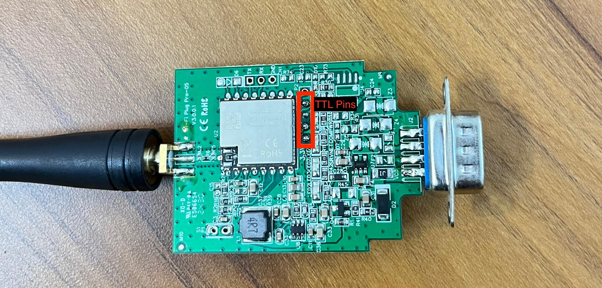

# Hybrid Inverter WiFi Plug Pro — DESS Emulator



## What This Project Does

SRNE/Voltronic/POWMR hybrid inverters come with an optional **WiFi Plug Pro** accessory.  
This plug contains an ESP8266-based module that connects to the inverter's internal Modbus RTU bus (TTL level, 2400 baud), reads live data, and uploads it to the **DESS cloud** (the manufacturer's monitoring platform and mobile app).

The problem: **DESS cloud goes dark the moment the inverter is replaced, repurposed, or simply offline** — because it only shows data from its own logger polling cycle, and the polling slave ID / register map is fixed to specific inverter models.

This project turns an **ESP32 or ESP-12F** into a **software emulator of the real inverter**, sitting between your own MQTT data pipeline and the WiFi Plug Pro's TTL pins. It intercepts every Modbus poll from the plug and responds with **live data sourced from your own MQTT broker** — making DESS believe it is talking to a real inverter at all times.

---

## System Architecture

```
Your Inverter / Solar Sensors
        │
        ▼
  Node-RED / MQTT Publisher
  (publishes 10 topics every 30 sec)
        │  MQTT  (WiFi)
        ▼
  ESP32 or ESP-12F  ◄──── This Repo
  (DESS Emulator)
        │  Modbus RTU TTL  (2400 baud, GPIO13/14)
        ▼
  WiFi Plug Pro  ←── TTL Pins (see photo above)
        │  HTTPS / Cloud
        ▼
  DESS Cloud + Mobile App
  (live energy chart, battery SOC, PV power, etc.)
```

The ESP sits **inline** on the WiFi Plug Pro's TTL header. Every time the plug polls for data (every ~30 seconds), the ESP responds instantly with the latest snapshot received from MQTT. No data sniffing required. No cloud dependency on the original inverter.

---

## MQTT Topics

Publish one **plain float string** (e.g. `245.7`) per topic.  
Set **retain = true** on every topic so the ESP gets the last value immediately on reconnect.

| Topic | Unit | Notes |
|---|---|---|
| `desstransmitter/data/mains/voltage` | V | ≤ 140 → inverter mode |
| `desstransmitter/data/mains/frequency` | Hz | |
| `desstransmitter/data/battery/voltage` | V | |
| `desstransmitter/data/battery/charging_amp` | A | Received, not used in status logic |
| `desstransmitter/data/battery/discharging_amp` | A | > 0 → Discharging; == 0 → Charging |
| `desstransmitter/data/battery/soc` | % | |
| `desstransmitter/data/pv/voltage` | V | |
| `desstransmitter/data/pv/current` | A | Stored, not used in register logic |
| `desstransmitter/data/pv/power_w` | W | > 10 → PV active |
| `desstransmitter/data/load/ac_w` | W | Base for VA and load% calculation |

---

## Derived Logic

The sketch automatically derives inverter status from incoming MQTT values on every poll:

| Condition | Effect on DESS |
|---|---|
| `pv_power_w > 10` | PV Status = Discharge (arrow animated in app) |
| `pv_power_w ≤ 10` | PV Status = Undervoltage |
| `mains_voltage > 140 V` | Line Mode, AC input shown, output tracks mains V/Hz |
| `mains_voltage ≤ 140 V` | Invert Mode, output = 230 V / 50 Hz nominal |
| `discharging_amp == 0` | Battery Status = Charging |
| `discharging_amp > 0` | Battery Status = Discharging |
| Load always | Load Status = On (Normal) |

**Load calculations:**
- `Output VA = load_ac_w ÷ 0.95` (PF assumed 0.95)
- `Load % = load_ac_w ÷ 6200 × 100` (6.2 kW inverter capacity, clamped to 100%)

---

## Hardware Variants

### ESP32 (Universal)

Works on any ESP32 board: ESP32-WROOM, ESP32-S3, ESP32-C3, DevKit, etc.

| Signal | GPIO |
|---|---|
| Logger RX (← Plug TX) | GPIO 15 |
| Logger TX (→ Plug RX) | GPIO 14 |
| Debug Serial | USB / UART0 |

Uses `HardwareSerial(2)` — full duplex, no timing issues.

📁 Sketch: [`dess_mqtt_esp32.ino`](dess_mqtt_esp32.ino)

**Library required:** [PubSubClient by Nick O'Leary](https://github.com/knolleary/pubsubclient) (install via Arduino Library Manager)

---

### ESP-12F (ESP8266)

Compact form factor. Uses `SoftwareSerial` — works reliably at 2400 baud.

| Signal | GPIO | NodeMCU Label |
|---|---|---|
| Logger RX (← Plug TX) | GPIO 13 | D7 |
| Logger TX (→ Plug RX) | GPIO 14 | D5 |
| Debug Serial | GPIO 1/3 | UART0 / USB |

> **GPIO 15 is intentionally avoided** — it requires a 10 kΩ pull-down to GND for stable boot.  
> GPIO 13 and GPIO 14 have no boot-mode constraints.

📁 Sketch: [`dess_mqtt_esp12f.ino`](dess_mqtt_esp12f.ino)

**Libraries required:**
- [PubSubClient by Nick O'Leary](https://github.com/knolleary/pubsubclient)
- ESP8266 core (install via Arduino Board Manager: `https://arduino.esp8266.com/stable/package_esp8266com_index.json`)

---

## WiFi Plug Pro TTL Wiring

The WiFi Plug Pro board exposes a 4-pin TTL header (see photo at top of this README).  
Pin are labelled on the PCB):


Connect:
- Plug **TX** → ESP GPIO 13 (RX of ESP)
- Plug **RX** → ESP GPIO 14 (TX of ESP)
- Plug **GND** → ESP GND
- Plug **VCC** → ESP 3.3V (optional — only if powering ESP from plug)

> The plug operates at **3.3 V TTL**. Do not connect 5 V directly.
To Power WiFi Plug Pro and connected Board, Supply 5v to Vcc of DB9 Connector
---

## Configuration (Edit Before Flashing)

In either sketch, edit these three lines at the top:

```cpp
#define WIFI_SSID       "YOUR_SSID"
#define WIFI_PASS       "YOUR_PASSWORD"
#define MQTT_BROKER     "192.168.1.100"   // your broker IP
```

All other parameters (slave ID, baud rate, nameplate values) are pre-configured for a **6.2 kW SRNE 48 V hybrid inverter** and match the DESS register map exactly.

---

## Hardcoded Nameplate Values

These match a specific inverter profile (validated from DESS cloud export, 2026-06-13).  
Change them in the `static const uint16_t` block if your inverter differs:

| Parameter | Value |
|---|---|
| Nominal capacity | 6200 W / 6200 VA |
| Nominal AC voltage | 230 V |
| Battery voltage | 48 V system |
| Slave ID | 5 |
| Baud rate | 2400 baud 8N1 |

---

## ⚠️ Safety & Disclaimer

> **Read this carefully before using any part of this project.**

This project involves interfacing with live electrical hardware — solar inverters, battery banks, and mains AC wiring. **Incorrect wiring or use can result in electric shock, fire, equipment damage, or personal injury.**

- This code and all associated files are provided **strictly as-is**, for **educational and personal experimentation only**.
- **I (Nitin, the author) am not responsible — in any way, under any circumstances — for any damage, injury, data loss, fire, electric shock, equipment failure, or any other harm** (direct, indirect, incidental, or consequential) arising from the use, misuse, or modification of this project.
- By using any part of this project, **you accept full and sole responsibility** for your own actions and their consequences.
- This project is **not a certified or safety-approved product**. It has not been tested to any electrical safety standard.
- **Do not use this project** if you are not confident working safely with low-voltage electronics and do not understand Modbus/serial communication basics.
- Always **double-check your wiring** before powering on. Never connect 5 V signals to 3.3 V TTL lines.
- Never work on live mains wiring. Isolate your inverter before opening any enclosure.
- The author makes **no warranty** of any kind — express or implied — regarding fitness for any purpose.

**Use entirely at your own risk. If in doubt, don't.**

---

## License

MIT — free to use, modify, and distribute.

---

*Built by [Nitin](https://github.com/ngoyat) · Rohtak, Haryana, IN*
